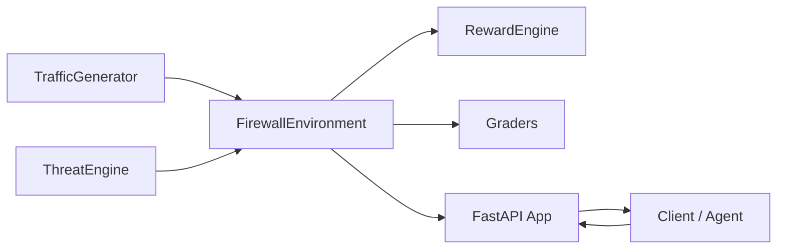
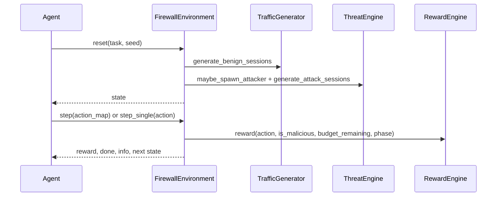

# Architecture

## System Diagram

## Runtime Data Flow

## Core Components

| Component | Responsibility | Key Outputs |
|---|---|---|
| `firewall_environment.py` | Episode orchestration, budget tracking, session lifecycle, metrics | `state()`, `step()`, `step_single()`, tool APIs |
| `traffic_generator.py` | Benign + malicious metadata generation, normalization, scenario shaping | 22-dim normalized observation vectors |
| `threat_engine.py` | Multi-attacker orchestration, adaptation, lifecycle and outcomes | Attack sessions, attacker status map |
| `reward_engine.py` | Multi-objective reward calculation and action-cost accounting | scalar reward + component breakdown |
| `graders.py` | Deterministic task scoring and pass/fail gating | score in `[0,1]`, pass constraints |
| `baseline/evaluate.py` | Policy benchmarking across tasks | JSON report for random/heuristic/block/allow |

## Environment Modes

- **Multi-session mode**: `step(action_map)` handles a variable batch of sessions per tick.
- **Single-session mode**: `step_single(action)` exposes one decision at a time with `Discrete(6)` semantics.
- **Inspect workflow**: inspect is first-stage evidence collection; follow-up action resolves the session.
